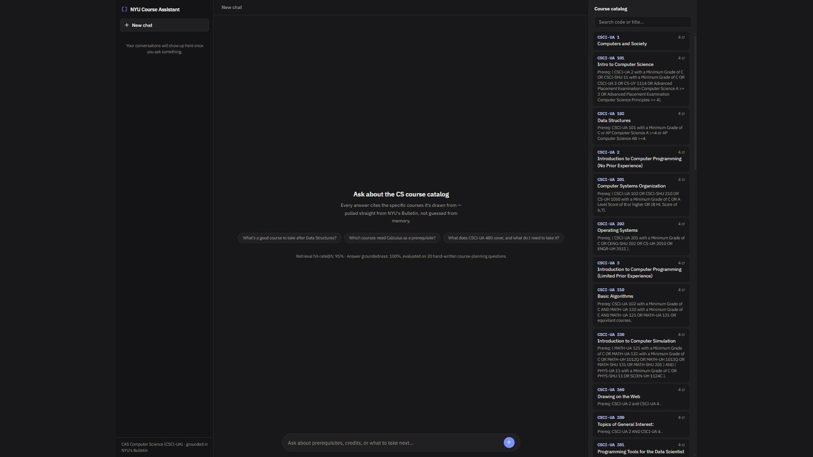

# NYU Course Catalog RAG Assistant

Ask natural-language questions about NYU's course catalog and get grounded,
cited answers instead of keyword-searching the Bulletin manually.

Scope: four CAS departments students actually cross-reference — Computer
Science (`CSCI-UA`), Math (`MATH-UA`), Data Science (`DS-UA`), and Physics
(`PHYS-UA`), 133 courses total — scraped from `bulletins.nyu.edu`. CAS has 51
department pages in total; the scraper's `DEPARTMENTS` map
(`ingest/scrape_catalog.py`) is a one-line-per-department list, so adding
more is mostly data verification, not code.



## Architecture

```
User query -> embed (sentence-transformers, local)
           -> hybrid retrieval (retrieval/search.py):
                - if the query names a course by code or title, surface that
                  course itself, then courses that list it as a prerequisite
                - fill remaining slots with pgvector cosine similarity search
           -> prompt Claude with retrieved courses + question
           -> answer with [COURSE-CODE] citations
```

Pure semantic search alone can't reliably answer "what's a good course after X" -
several courses often share the same prerequisite, so no single one is
uniquely favored by embedding similarity. It also can't be trusted to rank a
course above its own dependents when a query names that course directly
(e.g. "which course covers linear algebra" was losing `MATH-UA 140` itself
under four courses that require it). The hybrid step surfaces the named
course first, then its structural dependents, then lets embeddings fill out
the rest.

Ingestion (offline, re-run when the catalog updates):

```
bulletins.nyu.edu HTML -> scrape + parse (code, title, credits, prereqs, description)
                       -> one chunk per course (descriptions are short & self-contained)
                       -> embed -> store in Postgres/pgvector
```

## Stack

- **Backend:** Python, FastAPI (`app/server.py`)
- **Database:** Postgres + pgvector — a local instance via the included
  `docker-compose.yml` by default; swap in a managed Postgres (e.g. Supabase) by
  changing `DATABASE_URL` if you'd rather not run Docker. Holds courses/chunks for
  retrieval, plus `conversations`/`messages` for persisted chat history
- **Embeddings:** local `sentence-transformers/all-MiniLM-L6-v2` (no API key needed)
- **Generation:** Claude API — bring your own `ANTHROPIC_API_KEY`; nothing here is
  shared, hosted, or billed to anyone but you
- **Frontend:** React + Vite + TypeScript + Tailwind (`frontend/`) — a chat interface
  with persisted conversation history and a live catalog panel; clicking a citation
  in an answer jumps to and highlights that course in the panel

## Quickstart

Everything runs on your own machine with your own API key — nothing shared,
nothing to trust. Requires Python 3.10+, Node 18+ (works on 16 with npm engine
warnings, but 18+ is what the frontend's dependencies target), and
[Docker](https://docs.docker.com/get-docker/) (only if you're using the included
local Postgres instead of your own).

```bash
git clone https://github.com/saishettar/nyu-rag.git
cd nyu-rag

cp .env.example .env
# edit .env and set ANTHROPIC_API_KEY to your own key
# (get one at https://console.anthropic.com/settings/keys)
# DATABASE_URL already points at the Docker Postgres below - leave it as-is
# unless you're using your own Postgres/Supabase instance

docker compose up -d          # local Postgres + pgvector

python -m venv .venv
.venv/Scripts/activate         # or source .venv/bin/activate on macOS/Linux
pip install -r requirements.txt

cd frontend && npm install && cd ..
```

Then, one-time database setup (course data for all four departments is
already checked into the repo at `ingest/data/*.json`, so there's nothing to
scrape):

```bash
python db/init_db.py                  # create tables + pgvector extension
python embed/embed_and_store.py       # embed courses, store in Postgres
```

Then, in two terminals:

```bash
uvicorn app.server:app --reload --port 8000   # API (retrieval, generation, conversations)
cd frontend && npm run dev                    # chat UI, proxies /api to :8000
```

Open the URL Vite prints (usually `http://localhost:5173`) and ask a question.

To refresh the catalog data from the live Bulletin instead of using the
checked-in snapshot: `python ingest/scrape_catalog.py`, then re-run the two
database steps above.

## Evaluation

```bash
python eval/evaluate.py
```

Runs 26 hand-written course-planning questions (`eval/test_questions.json`)
against the live pipeline and reports:

- **Retrieval hit-rate@5** — did the correct course appear in the top-5 results?
- **Answer groundedness** — a second Claude call judges whether each answer
  is fully supported by the retrieved courses and cites a course code.

### Results (133 courses across 4 departments, 26 hand-written questions)

- **Retrieval hit-rate@5: 26/26 (100%)** on the run in `eval/eval_results.json`
- **Answer groundedness: 25/26 (96%)** on that same run — this genuinely
  fluctuates a question or two across runs (LLM-judge grading has real
  run-to-run wording variance, e.g. how strictly it parses which grade
  requirement applies to which option in an OR'd prerequisite list), so treat
  "95-100%" as the honest range rather than either endpoint as a hard guarantee

Retrieval history, in order:

1. **90% → 95%:** the embedded chunk text originally included only the title
   and description, not `prerequisites`, so "what comes after X" queries had
   no textual signal to match on at all. Folding prerequisites into the
   embedded text (`embed/embed_and_store.py`) fixed most of that.
2. **95% → 100%** (on the original 20-question, CSCI-UA-only set): the one
   remaining miss — "What's a good course to take after Data Structures?" —
   was a structural limitation, not a data gap: four courses (`CSCI-UA 201`,
   `310`, `473`, `479`) all list Data Structures (`CSCI-UA 102`) as a
   prerequisite, so no single one was uniquely favored by embedding
   similarity alone. Fixed with hybrid retrieval (`retrieval/search.py`):
   when a query names a course by code or title, courses that list it as a
   prerequisite are surfaced alongside it, and embeddings rank and fill out
   the rest.
3. **Bug found while adding Math/Data Science/Physics:** that hybrid step
   was excluding the named course itself from its own results - "which
   course covers linear algebra" surfaced four courses that require
   `MATH-UA 140` but not `MATH-UA 140` itself. Fixed by always including the
   named course alongside its dependents rather than instead of it; verified
   against the original 20 questions (still 20/20) before adding 6 new
   questions for the expanded scope.

### CI regression check

Separate from the eval script above: `.github/workflows/eval.yml` runs
`eval/suite.yaml` (an [iris-eval](https://github.com/saishettar/iris/tree/main/eval)
suite, not `eval/evaluate.py`) against every PR touching `generation/**`, and
posts pass/fail per test case as a PR comment. Needs an `ANTHROPIC_API_KEY`
repo secret (Settings > Secrets and variables > Actions) to run the real
judge calls -- without it, the workflow fails with an auth error rather than
skipping silently.

## Repository structure

```
ingest/             scrape_catalog.py, parse_course.py
embed/              embed_and_store.py
db/                 schema.sql, init_db.py
retrieval/          search.py
generation/         answer.py
app/                server.py (FastAPI), db.py (conversations/messages + course queries)
frontend/           React + Vite + Tailwind chat UI
eval/               test_questions.json, evaluate.py
docker-compose.yml  local Postgres + pgvector for self-hosting
```

## License

MIT — see [LICENSE](LICENSE).
